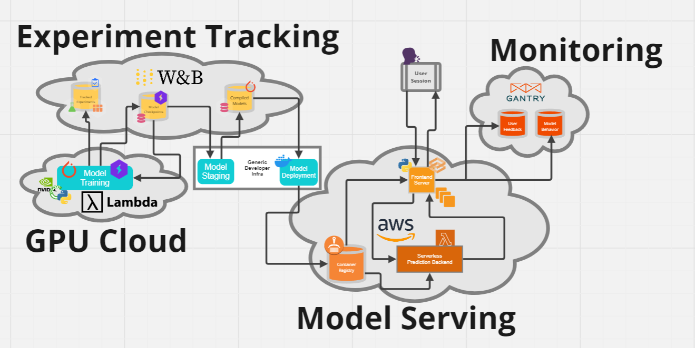

# [Lab00 Notes: Architecture overview](https://colab.research.google.com/github/full-stack-deep-learning/fsdl-text-recognizer-2022-labs/blob/main/overview.ipynb#scrollTo=OggjLhU3f9gk)
[Link](https://miro.com/app/board/uXjVOrOHcOg=/)

The main components for the architecture are:
- **GPU Cloud**: Used for model training
    - We'll train a ResNet encoder to process the images and a Transformer decoder to produce the output text.
    - Purchasing GPUs and properly setting up a multi-GPU machine is challenging and has high up-front costs. So we run our training via a cloud provider, specifically [Lambda Labs GPU Cloud](https://lambdalabs.com/service/gpu-cloud).
    - Because the heavy work is done on the GPU, using lower-level libraries, we don't need to write the majority of our model development code in a performant language like C/C++ or Rust.
    - Although we'll use Pytorch, there are two major alternatives to PyTorch for providing accelerated, differentiable array math, both from Google: early mover TensorFlow and new(ish)comer JAX.
    - PyTorch provides a number of features required for creating deep neural networks, but it doesn't include a high-level framework for training or any of a number of related engineering tasks, like metric calculation or model checkpointing. We use the PyTorch Lightning library as our high-level training engineering framework. PyTorch Lightning is the framework of choice for generic deep learning in PyTorch, but in natural language processing, many people instead choose libraries from Hugging Face. Keras is the framework of choice for TensorFlow. In some ways, Flax is the same for JAX; in others, there is not as of July 2022 a high-level training framework in JAX.
- **Experiment tracking**: Used for keeping track of models checkpoints, training, and registries.
- **Model Serving**: Grabbing production ready models, packaging them into a docker container and deploying them using a front end server and lambda functions as backends.
    - Front end build using Gradio
    - Front end application includes a "flag" feature to get user feedback and send it to Gantry.\
    - Communication between Front and Back end occurs through a JSON API.
    - Our model is wrapped up in a docker container and deployed using Lambda Functions serverlessly.  
- **Monitoring**: Get user feedback and track model behavior in production.

