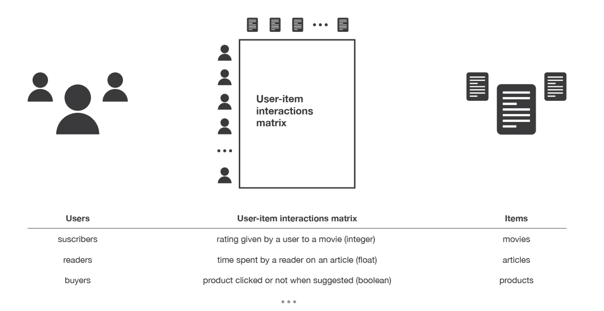
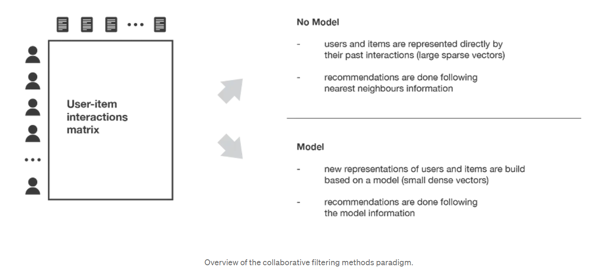
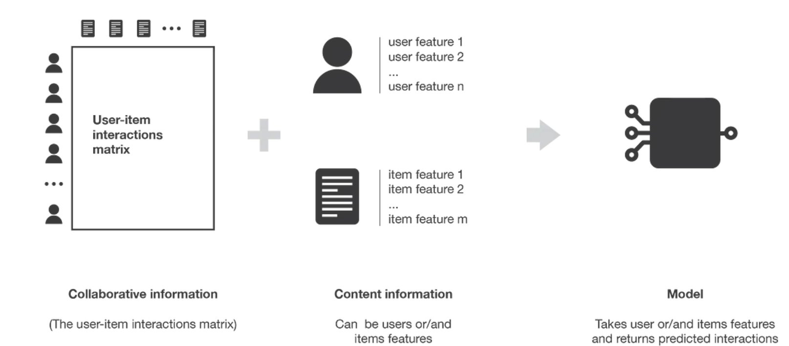
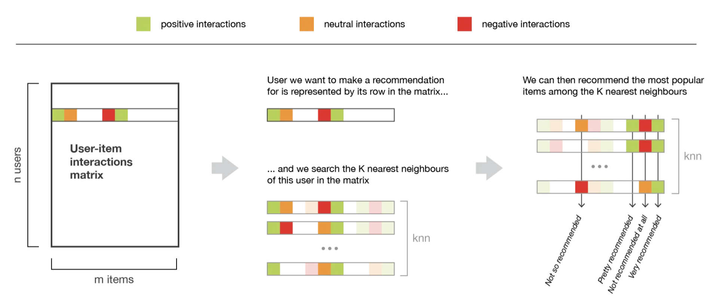
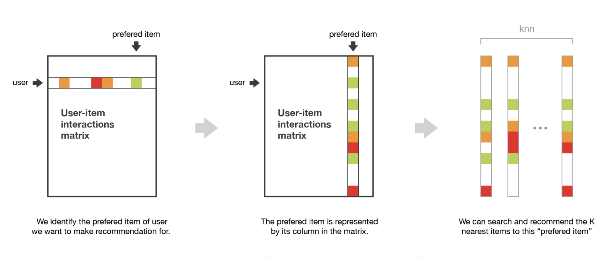
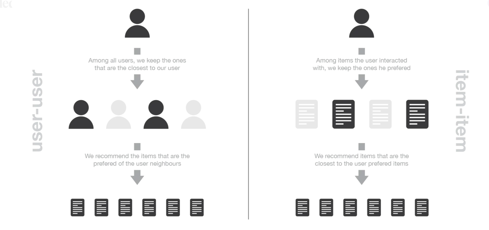
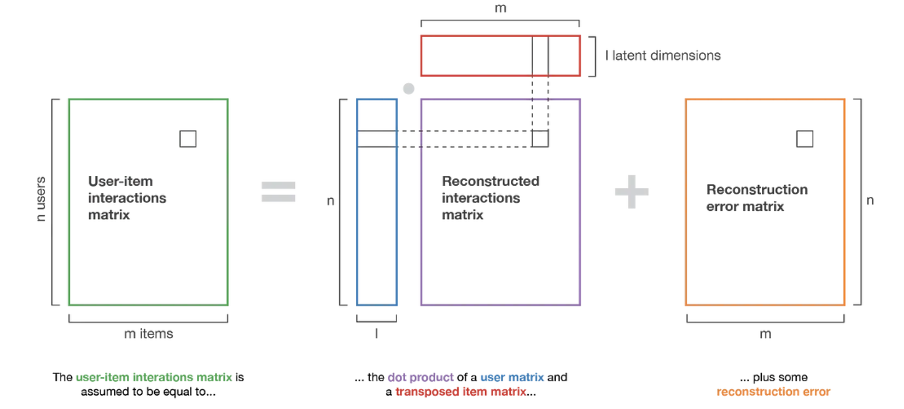
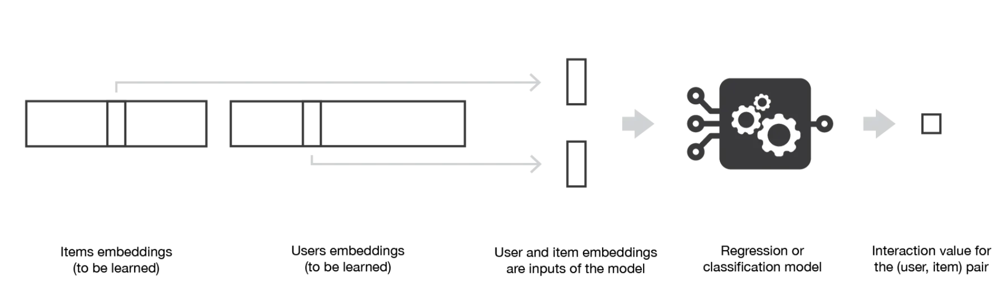
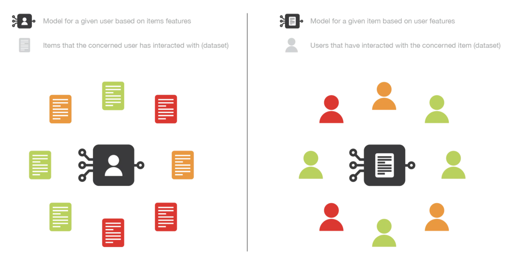

# Recommender Systems

# [Introduction to recommender systems](https://towardsdatascience.com/introduction-to-recommender-systems-6c66cf15ada)
We will go through different paradigms of recommender systems. 

Two major paradigms of recommender systems: 
- **Collaborative based methods** 
- **Content based methods** 

### Collaborative based methods

Are based solely on the past interactions recorded between users and items in order to produce new recommendations. These interactions are stored in the so-called “user-item interactions matrix”. The main idea that rules collaborative methods is that these past user-item interactions are sufficient to detect similar users and/or similar items and make predictions based on these estimated proximity's

These models are divided into two sub-categories:
- **Memory Based**: Directly works with values of recorded interactions, assuming no model, and are essentially based on nearest neighbors search (for example, find the closest users from a user of interest and suggest the most popular items among these neighbors)
- **Model Based**: Assume an underlying “generative” model that explains the user-item interactions and try to discover it in order to make new predictions.

Pros and Cons of collaborative method:
- **Pros**:
    - Require no information about users or items.
    - The more users interact with items the more new recommendations become accurate: for a fixed set of users and items, new interactions recorded over time bring new information and make the system more and more effective.
- **Cons** (Cold start problem):
    - It is impossible to recommend anything to new users.
    - Its also impossible to recommend a new item to any users.
    - Its hard when  many users or items have too few interactions to be efficiently handled.
    - Some strategies to mitigate these cons are: recommending random items to new users or new items to random users (random strategy), recommending popular items to new users or new items to most active users (maximum expectation strategy),  recommending a set of various items to new users or a new item to a set of various users (exploratory strategy) or, finally, **using a non collaborative method for the early life of the user or the item.**

### Content based methods

These methods not only rely on on the user-item interactions (like in collaborative), but also use additional information about users and/or items. This additional information can be, for example, the age, the sex, the job or any other personal information for users as well as the category, the main actors, the duration or other characteristics for the movies (items).

Then, the idea of content based methods is to try to **build a model**, based on the available “features”, **that explain the observed user-item interactions**. The prediction is then easy, just look at the features an recommend based on that.

Content based methods suffer far less from the cold start problem than collaborative approaches: new users or items can be described by their characteristics (content) and so relevant suggestions can be done for these new entities. Only new users or items with previously unseen features will logically suffer from this drawback, but once the system old enough, this has few to no chance to happen.

### Models, bias and variance

- **Memory based collaborative methods:** these methods have theoretically a **low bias** but a **high variance**. The algorithms directly works with the user-item interactions: for example, users are represented by their interactions with items and a nearest neighbors search on these representations is used to produce suggestions. No latent model is assumed.
- **Model based collaborative methods:** theoretically a **higher bias** but a **lower variance** than methods assuming no latent model. Some latent interaction model is assumed. The model is trained to reconstruct user-item interactions values from its own representation of users and items.
- **Content based methods:** tends to have the **highest bias** but the **lowest variance**. Some latent interaction model is also assumed. However, here, the model is provided with content that define the representation of users and/or items. This model is more constrained (because representation of users and/or items are given).

## Collaborative filtering: Memory based approaches

**Main characteristic:** use only information from the user-item interaction matrix and they assume no model to produce new recommendations.

### User-user
Identify users with the most similar “interactions profile” (nearest neighbors) in order to suggest items that are the most popular among these neighbors (and that are “new” to our user).

We consider that two users are similar if they have interacted with a lot of common items in the same way (similar rating, similar time hovering…).

### Item-item
Find items similar to the ones the user already “positively” interacted with. Two items are considered to be similar if most of the users that have interacted with both of them did it in a similar way. 

Notice that in order to get more relevant recommendations, we can do this job for more than only the user’s favorite item and consider the n preferred items instead. In this case, we can recommend items that are close to several of these preferred items.

### Comparing user-user and item-item

User-user: In general, every user have only interacted with a few items, it makes the method pretty sensitive to any recorded interactions (**high variance**). On the other hand, as the final recommendation is only based on interactions recorded for users similar to our user of interest, we obtain more personalized results (**low bias**).

Item-item: In general, a lot of users have interacted with an item, the neighborhood search is far less sensitive to single interactions (**lower variance**). As a counterpart, interactions coming from every kind of users (even users very different from our reference user) are then considered in the recommendation, making the method less personalized (**more biased**). **This approach is less personalized than the user-user approach but more robust.**

### Complexity and Side Effect

One of the biggest flaw of memory based collaborative filtering is that they do not scale easily: generating a new recommendation can be **extremely time consuming for big systems**: The nearest neighbors search step can become intractable if not carefully designed (KNN algorithm has a complexity of O(ndk) with n the number of users, d the number of items and k the number of considered neighbors). A workaround for this is to take advantage of the sparsity of the interaction matrix when designing our algorithm or use approximate nearest neighbors methods (ANN).

Its is necessary to be extremely careful to avoid a “rich-get-richer” effect for popular items and to avoid getting users stuck into what could be called an “**information confinement area**”. With the lack of model “to regularize”, this kind of phenomenon can be accentuated and observed more frequently.

## Collaborative filtering: Model based approaches

Model based collaborative approaches only rely on user-item interactions information and assume a latent model supposed to explain these interactions. 

### Matrix factorization
Decomposing the huge and sparse user-item interaction matrix into a product of two smaller and dense matrices: a user-factor matrix (containing users representations) that multiplies a factor-item matrix (containing items representations). **Main assumption**: there exists a pretty low dimensional latent space of features in which we can represent both users and items and such that the interaction between a user and an item can be obtained by computing the dot product of corresponding dense vectors in that space.

Note that **we don’t want to give explicitly these features to our model** (as it could be done for content based approaches). We prefer to let the system discover these useful features by itself. These features have a mathematical meaning but no intuitive interpretation to humans. However we can in general see that close users in terms of preferences as well as close items in terms of characteristics ends up having close representations in the latent space.

A more complex approach is to use these item and user factor vectors as inputs to a NN which will be used to predict the interaction value for pairs (user, item):

## Content based approaches
The recommendation problem is casted into either a **classification problem** (predict if a user “likes” or not an item) or into a **regression problem** (predict the rating given by a user to an item). 

**Item-centred:** This method is based on **based on users features**. We try to answer “what is the probability for each user to like this item?”, for classification or “what is the rate given by each user to this item?”, for regression. Tends to be less personalized (more biased) than the user-centred. Leads to pretty robust models as a lot of users have interacted with the item.

**User-centred:** We are working with **items features**. We try to answer the question “what is the probability for this user to like each item?”, for classification or “what is the rate given by this user to each item?”, for regression. We attach a model to each user that is trained on its data. Tends to be more personalized than its item-centred counterpart.  However, its far less robust than an item-centred since most of the time a user has interacted with relatively few items.

**Note:** From a practical point of view, we should underline that, most of the time, it is much more difficult to ask some information to a new user (users do not want to answer too much questions) than to ask lot of information about a new item (people adding them have an interest in filling these information in order to make their items recommended to the right users). We can also notice that, depending on the complexity of the relation to express, the model we build can be more or less complex, ranging from basic models (logistic/linear regression for classification/regression) to deep neural networks. Finally, let’s mention that content based methods can also be neither user nor item centred: both information about user and item can be used for our models, for example by stacking the two features vectors and making them go through a neural network architecture.

## Evaluation of a recommender system

Evaluation methods for recommender systems can mainly be divided in two sets: evaluation based on well defined metrics and evaluation mainly based on human judgment.

### Evaluation based on well defined metrics

If our model outputs **numeric values** (ratings predictions or matching probabilities) we can user error measurement metrics (like MSE). For this, the model should be trained only on a part of the available interactions and is tested on the remaining ones. We could also binarize these values with a classical threshold approach and evaluate the model in a more “classification way”.

On the other hand, if we now consider a recommender system not based on numeric values and that only returns a **list of recommendations** we can still define a precision like metric by estimating the proportion of recommended items that really suit our user (like masking out values in training and seeing if out model predicts the real interactions).

### Evaluation based on human judgment

In recommender systems we might expect some other good properties such as diversity and explainability of recommendations. We absolutely want to avoid having a user being stuck in what we called earlier an information confinement area. **“Serendipity”** is often used to express the tendency a model has or not to create such a confinement area.

Serendipity, that can be estimated by computing the distance between recommended items, should not be too low as it would create confinement areas, but should also not be too high as it would mean that we do not take enough into account our users interests when making recommendations (exploration vs exploitation).

**Explainability** is another key point of the success of recommendation algorithms. Indeed, it has been proven that if users do not understand why they had been recommended as specific item, they tend to loose confidence into the recommender system. So, if we design a model that is clearly explainable, we can add, when making recommendations, a little sentence stating why an item has been recommended (“people who liked this item also liked this one”, “you liked this item, you may be interested by this one”, …).

Both of these are difficult to evaluate. So, we can evaluate its ability to generate the expected action. For example, the system can be put in production, following an A/B testing approach, or can be tested only on a sample of users. Such processes require, however, having a certain level of confidence in the model.

## Note on Hybrid approaches

The combination made in hybrid approaches can mainly take two forms: we can either train two models independently (one collaborative filtering model and one content based model) and combine their suggestions or directly build a single model (often a neural network) that unify both approaches by using as inputs prior information (about user and/or item) as well as “collaborative” interactions information.

# [How to Design and Build a Recommendation System Pipeline in Python (Jill Cates)](https://www.youtube.com/watch?v=v_mONWiFv0k)

Collaborative filtering case

###  Pre-processing
- Doesn't perform well on very sparse matrices. To know that calculate matrix sparsity. A typical threshold is .5%. If its less that that then you might need to take a different approach than collaborative filtering.
- Doesn't perform well on new users and new items. If we have a high proportion of new items or users then we might need to consider using content based filtering or a hybrid approach.
- Matrix factorization is used to get our user-item matrix split into two "latent factors" matrices: 1) user-K, 2) item-K. Once we take inner product of these two we are back to a "reconstructed" version of the user-item matrix but now all null values are populated. These represents the "predicted" ratings.
- A common evaluation metric to use for training is Precision@K. It looks at the top k recommendations and calculates what proportion of those recommendations were actually relevant to a user. ==How do you know that??==

###  Hyperparameter tuning
- Methods: Grid Search, Random Search, sequential model-based optimization.

### Model Training
- We use the reconstructed matrix to make our recommendations.

### Post-processing
- Sort the predicted ratings and get the top K recommendations to render to the user.
- Filter out items that the user has already purchased, viewed, interacted with.
- By following the described process we are also in a situation where we can offer item-item recommendations. You apply similarity metric to item-item and recommend items based on: "Because you watched movie X". "The most similar movies from a movie".

### Evaluation
- Best way to test a recommender is in the wild.
- If thats not possible you do offline evaluation: You do that by masking random interactions in our matrix and using that as our training set. You essentially pretend that you don't know a users rating of a movie but you actually do and you compare the predicted rating with the true rating.
- Some metrics used for evaluation:
    - RMSE
    - Precision
    - Recall
    - F1

# [Recommender Systems — A Complete Guide to Machine Learning Models](https://towardsdatascience.com/recommender-systems-a-complete-guide-to-machine-learning-models-96d3f94ea748)

## Recommender Systems: Why And How?

## Explicit Feedback vs. Implicit Feedback
In recommender systems, machine learning models are used to predict the rating rᵤᵢ of a user u on an item i. At inference time, we recommend to each user u the items l having highest predicted rating rᵤᵢ.

**Explicit feedback** is a rating explicitly given by the user to express their satisfaction with an item. **It is hard to collect** as most users typically don’t write reviews or give explicit ratings for each item they purchase.

Implicit feedback, on the other hand, assume that user-item interactions are an indication of preferences. This feedback is **extremely abundant**, but at the same time it is less detailed and **more noisy** (e.g. someone may buy a product as a present for someone else). **Most modern Recommender Systems tend to rely on implicit feedback.**

## Content based approach
Content-based methods describe users and items by their known metadata. To train a Machine Learning model with this approach we can use a k-NN model. For instance, if we know that user u bought an item i, we can recommend to u the available items with features most similar to i.

**Advantages:** Avoid  Cold-Start scenarios where a new item or user is added to the platform and we don’t have user-item interactions to train our model.

**Disadvantages:** we don’t use the full set of known user-item interactions (each user is treated independently), and that we need to know metadata information for each item and user.

## Collaborative filtering approach
Collaborative filtering methods do not use item or user metadata, but try instead to leverage the feedbacks or activity history of all users in order to predict the rating of a user on a given item by inferring interdependencies between users and items from the observed activities.

To train a Machine Learning model with this approach we typically try to cluster or factorize the rating matrix rᵤᵢ in order to make predictions on the unobserved pairs (u,i) typically using a Matrix Factorization algorithm (PMF, SVD, SVD++ for both implicit and explicit matrices).

**Advantages:** Whole set of user-item interactions (i.e. the matrix rᵤᵢ) is used, which typically allows to obtain higher accuracy than using Content-Based models.

**Disadvantages:** It requires to have a few user interactions before the model can be fitted.

## Hybrid Approach: LightFM
The Python library LightFM implements one of the most popular hybrid algorithms.

